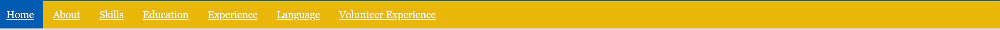
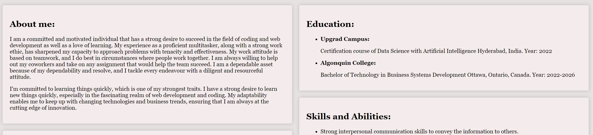

# Vishnu Malkapuram's Portfolio Design Documentation:

A clear and simplified summary of the design system applied for the portfolio project is provided in this documentation. The design is clearly communicated through the use of colours, typography, components, and layouts as well as screenshots of mock-ups.

## **1. Color Palette:**
I used a constant color pallette throughout the portfolio. I used a royal blue + crown yellow color palette.
- **Primary Color:** `I have used a mix of royal blue and crown yellow color as a color palette for my portfolio.(#003f88,#e8b707)`
- **Text Color in header, footer and navigation bar:** `#ffffff`
- **Text Color in the body:** `#000000`
- **Border Color for the image:** `#fdc500`
- **Background Color for the body:** `#e7e2e2`
- **Background Color for the containers:** `#f4ecec`
(Background color for the body and the container defer very slightly so that there is a distinction between these two elements.)
- **Accent Color:** `#015bb0`

## **2. Typography**
- **Body Text:** `Georgia, "Times New Roman", Times, serif`
- **Header text and Footer text:** `'Franklin Gothic Medium', 'Arial Narrow', Arial, sans-serif`

## **3. Components and Layout**
### Header
- **Design:** The header background is created using a linear gradient. It starts with a deep blue color (#003f88) at the top and transitions to a lighter blue color (#015bb0) at the bottom..
- **Mock-up Screenshot:**

### Navigation
- **Design:** The navigation bar is designed with a bright yellow background and light grey text links that are oriented horizontally.
- **Mock-up Screenshot:**

### Content
- **Design:** The layout design for the main content is column based layout where I created 2 columns that has an equal width, centered alignment, and a gap of 10% between them. And within the columns are containers that have a maximum width, centered alignment, and a box shadow to give good visual effect. The containers carry the main content with a background color of #f4ecec.
- **Mock-up Screenshot:**

### Footer
- **Design:** The footer is designed with a blue background just like the header of the web portfolio, with white text, centered alignment and with an email id attached to the hyper link, which, when clicked on it opens the mail app to send a mail.
- **Mock-up Screenshot:**

## **Conclusion**
This design documentation outlines the key elements and choices made for portfolio project. The design system incorporates a consistent color palette of royal blue and crown yellow, creating a visually appealing and cohesive look. Typography choices are made for body text and headers/footers, providing readability and style.
This documentation serves as a concise reference guide for the design system used in the portfolio project, aiming to facilitate development and maintain consistency in design throughout the project.

